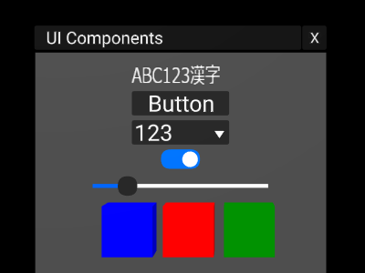

# xyLayout

Flexbox like layout + UI components for [A-Frame](https://aframe.io/).

## Examples

Live demos:

- [Flexbox like Layout](https://binzume.github.io/aframe-xylayout/examples/layout.html)
- [UI Components](https://binzume.github.io/aframe-xylayout/examples/widgets.html) (including multi byte characters support)
- [Virtual keyboard](https://binzume.github.io/aframe-xylayout/examples/keyboard.html) (Japanese input method is available)





## Usage

Use [xylayout-all.min.js](./dist/xylayout-all.min.js) (35kB)

Include `xylayout-all.min.js` after the AFrame.

```html
<script src="https://aframe.io/releases/1.1.0/aframe.min.js"></script>
<script src="https://binzume.github.io/aframe-xylayout/dist/xylayout-all.min.js"></script>
...
<a-xycontainer direction="column" spacing="0.1" padding="0.2">
    <a-xylabel value="ABC123漢字" width="2" height="0.5"></a-xylabel>
    <a-xybutton label="Button"></a-xybutton>
    <a-xyselect values="abc,123,Foo,Bar" select="1"></a-xyselect>
    <a-xytoggle value="true"></a-xytoggle>
    <a-xyrange width="4" height="0.5" value="20"></a-xyrange>
    <a-xycontainer direction="row" spacing="0.2">
        <a-box color="blue"></a-box>
        <a-box color="red"></a-box>
        <a-box color="green"></a-box>
    </a-xycontainer>
</a-xycontainer>
```

## Building xylayout-all.min.js

```bash
npm install
npm run dist
```

## Primitives

| Primitive     | Components            | Description |
| ------------- | --------------------- | ----------- |
| a-xycontainer | xycontainer           | Layout container |
| a-xylabel     | xylabel               | Text label  |
| a-xybutton    | xybutton, xylabel     | Button      |
| a-xytoggle    | xytoggle              | Toggle button |
| a-xyrange     | xyrange               | Slider      |
| a-xyselect    | xyselect              | Option selector |
| a-xyscroll    | xyscroll, xyclipping  | Scroll      |
| a-xywindow    | xywindow, xycontainer | Window      |
| a-xyinput     | xyinput, xylabel      | Text input field |
| a-xykeyboard  | xykeyboard, (xyime)   | Screen keyboard |

- In addition, `xyrect` will also be attached.
- There are `xyitem`, `xylist` and `xydraggable` as components that are not associated with primitives.
- The default size of UI objects may be too large, so adjust it by `scale`. 
- See [examples](./examples)

## Components

### xycontainer

A component that layouts 3D objects on the XY plane.

[CSS Flexbox](https://developer.mozilla.org/en-US/docs/Web/CSS/CSS_Flexible_Box_Layout) linke layout is available.

Properties:

| name | default | Description | values |
| ---- | ------- | ---- | ------ |
| direction    | column | Defining the main axis | 'row', 'column' ('horizontal', 'vertical') |
| justifyItems | start  | layout mode for along the main axis | 'center', 'start', 'end', 'space-between', 'space-around', 'stretch'|
| alignItems   | none   | layout mode for along the cross axis  |'none', 'center', 'start', 'end', 'stretch'|
| alignContent | none   | layout mode for lines, if wrap |'none', 'center', 'start', 'end', 'stretch'|
| spacing      | 0      | spacing between items | number |
| padding      | 0      | padding around items | number |
| wrap         | nowrap | wrap mode | wrap, nowrap |
| reverse      | false  | Reverse the layout direction |  |

### xyitem

A component that controls how child elements are placed in a `xycontainer`.
The properties of this component take precedence over the parameters specified in the parent container.

Properties:

| name | type | default | Description |
| ---- | ---- | ------- | ---- |
| align  | align   | none  | see xycontainer.alignItems |
| grow   | number  | 1     | stretch factor for growing |
| shrink | number  | 1     | stretch factor for shrinking |
| fixed  | boolean | false | ignore layout if set to true |

### xyrect

Components that provide element sizes and pivots for `xycontainer`.
By default, xycontainer uses the width and height attributes of the element. 
If width and height do not represent the actual size of the object (e.g. `a-sphere`), we need to be specified in this component.

#### Properties:

| name | type | default | Description |
| ---- | ---- | ------- | ---- |
| width  | number | -1  | width of element. use size of geometry if set to -1 |
| height | number | -1  | height of element. use size of geometry if set to -1 |
| pivot  | vec2   | (0.5, 0.5) | pivot position. bottom left is `0 0`. Most primitive of a-frame have their origin at the center(`0.5 0.5`). |

#### Events:

| name | event.detail | Description |
| ---- | ------------ | ---- |
| xyresize | {xyrect} | Resize event |

### xywindow

Properties:

| name | type | default | Description |
| ---- | ---- | ------- | ---- |
| title    | string   |      | title of window |
| closable | boolean  | true | closable |
| background | boolean  | true | background plane |

### xylabel

An alternative to the text component.
This component will fallback to rendering with Canvas if `value` contains multibyte characters.

#### Properties:

| name | type | default | Description |
| ---- | ---- | ------- | ---- |
| value         | string |      | text |
| align         | string | left | text alignment |
| xOffset       | number | 0    | X-offset |
| zOffset       | number | 0.01 | Z-offset |
| renderingMode | string | auto | `canvas`: always use canvas for rendering. `auto`: use text if possible |
| resolution    | number | 32   | Canvas height |

see [text](https://aframe.io/docs/1.1.0/components/text.html)


### xybutton

#### Properties:

| name | type | default | Description |
| ---- | ---- | ------- | ---- |
| color | color | | button surface color |
| hoverColor | color | | hover color |

#### Events:

| name | event.detail | Description |
| ---- | ------------ | ---- |
| click |   | Click event |

### xytoggle

#### Properties:

| name | type | default | Description |
| ---- | ---- | ------- | ---- |
| value | boolean | false | state of the toggle |

NOTE: This component defines `value` property into the DOM element.

#### Events:

| name | event.detail | Description |
| ---- | ------------ | ---- |
| change | {value} | changed event |

### xyrange

#### Properties:

| name | type | default | Description |
| ---- | ---- | ------- | ---- |
| min   | number | 0   | min value |
| max   | number | 100 | max value |
| value | number | 0   | initial value |
| step  | number | 0   | step of value |
| thumbSize | number | 0.4 | Thumb size |

NOTE: This component defines `value` property into the DOM element.

#### Events:

| name | event.detail | Description |
| ---- | ------------ | ---- |
| change | {value} | changed event |

### xyselect

#### Properties:

| name | type | default | Description |
| ---- | ---- | ------- | ---- |
| values | array | []    | choices |
| select | int   | 0     | selected index for the choices |
| toggle | boolean | false | If set to true, the value will toggle with each click instead of displaying the choices |

#### Events:

| name | event.detail | Description |
| ---- | ------------ | ---- |
| change | {value, index} | changed event |

### xylist

List component that supports element recycling.
Intended to be used as a child element of xyscroll.

#### Properties:

| name | type | default | Description |
| ---- | ---- | ------- | ---- |
| itemWidth  | number | -1 | width of a item |
| itemHeight | number | -1 | height of a item |

#### Events:

| name | event.detail | Description |
| ---- | ------------ | ---- |
| clickitem | {index} | click item event |

#### Method:

Needs to be initialized by `xylist.setAdapter()` and `xylist.setContents()`.
See [list example](https://binzume.github.io/aframe-xylayout/examples/list.html).

- setAdapter({createFunc, bindFunc}): set creating list elements and binding content.
- setContents(data, optional_count): set contents of list.
- setLayout({sizeFunc, targetsFunc, layoutFunc}): set custom layout (optional)


### xyscroll

A component that makes element scrollable.
#### Properties:

| name | type | default | Description |
| ---- | ---- | ------- | ---- |
| scrollbar | boolean | true | Show scrollbar |

#### Events:

| name | event.detail | Description |
| ---- | ------------ | ---- |
| xyviewport | [t, b, l, r]| viewport change event |

- Make sure xyscroll has only one child. If there are multiple children, only the first one will be scrolled.
- This component treats the bottom left as the origin.
- The scroll bar can only be used vertically.
### xyclipping

A component that clips UI rendering. Intended to be used with xyscroll.

The outside of the area represented by xyrect will no longer be rendered. 
#### Properties:

| name | type | default | Description |
| ---- | ---- | ------- | ---- |
| clipTop    | boolean  | true  | Clip top |
| clipBottom | boolean  | true  | Clip bottom |
| clipLeft   | boolean  | false | Clip left |
| clipRight  | boolean  | false | Clip right |
| exclude    | selector |       | excluded elements |

Known issue: It doesn't work properly except with the standard Three.js shader. (e.g. a-text )


### xyinput

text input box.

#### Properties:

| name | type | default | Description |
| ---- | ---- | ------- | ---- |
| value | string |  | text |
| type | string |  | '', 'number', 'password' |
| placeholder | string |  | Text for placeholder |
| caretColor  | color | | Caret color |
| bgColor  | color | white | Background color |

NOTE: This component defines `value` property into the DOM element.

### xykeyboard

A component displays screen keyboard. Sends `KeyboardEvent` to the focused element.

#### Properties:

| name | type | default | Description |
| ---- | ---- | ------- | ---- |
| ime | boolean | false | Enable Japanese input method |

### xyime

A component used internally by `xykeyboard`.

# License

MIT License
