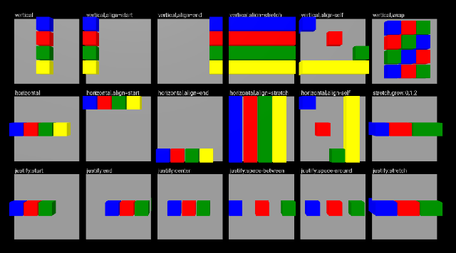
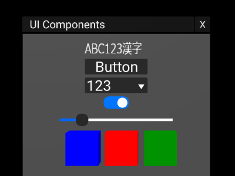
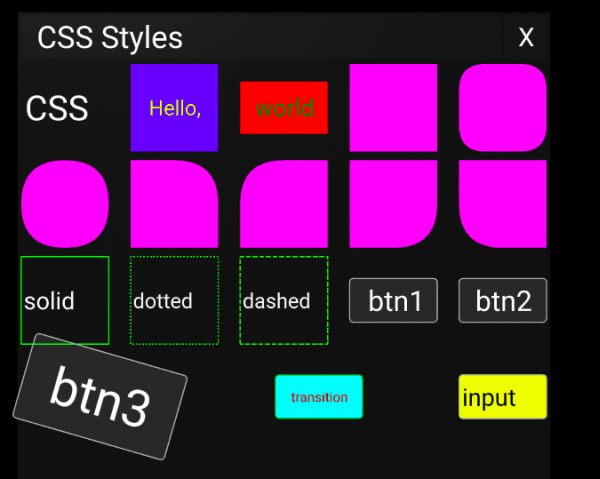

# xyLayout

Flexbox like layout + UI components for [A-Frame](https://aframe.io/).

- [English documentation](README.en.md)

## Examples

Live demos:

- [Flexbox like Layout](https://binzume.github.io/aframe-xylayout/examples/layout.html)
- [UI Components](https://binzume.github.io/aframe-xylayout/examples/widgets.html) (マルチバイト文字列対応)
- [Virtual keyboard](https://binzume.github.io/aframe-xylayout/examples/keyboard.html) (日本語入力対応)
- [CSS example](https://binzume.github.io/aframe-xylayout/examples/css-style.html) (CSSでスタイルを指定)

[](https://binzume.github.io/aframe-xylayout/examples/layout.html)
[](https://binzume.github.io/aframe-xylayout/examples/widgets.html)
[](https://binzume.github.io/aframe-xylayout/examples/css-style.html)

## Usage

Use [xylayout-all.min.js](./dist/xylayout-all.min.js) (35kB)

AFrameのあとに`xylayout-all.min.js`を読み込んでください．

ES2015 をサポートしたブラウザが必要です．(最新版の Chrome, Firefox, Edge で動作します)

```html
<script src="https://aframe.io/releases/1.1.0/aframe.min.js"></script>
<script src="https://binzume.github.io/aframe-xylayout/dist/xylayout-all.min.js"></script>
...
<a-xycontainer direction="column" spacing="0.1" padding="0.2">
    <a-xylabel value="ABC123漢字" width="2" height="0.5"></a-xylabel>
    <a-xybutton label="Button"></a-xybutton>
    <a-xyselect values="abc,123,Foo,Bar" select="1"></a-xyselect>
    <a-xytoggle value="true"></a-xytoggle>
    <a-xyrange width="4" height="0.5" value="20"></a-xyrange>
    <a-xycontainer direction="row" spacing="0.2">
        <a-box color="blue"></a-box>
        <a-box color="red"></a-box>
        <a-box color="green"></a-box>
    </a-xycontainer>
</a-xycontainer>
```

### Building xylayout-all.min.js

```bash
npm install
npm run dist
```

## Primitives

| Primitive     | Components            | Description |
| ------------- | --------------------- | ----------- |
| a-xycontainer | xycontainer           | Layout container |
| a-xylabel     | xylabel               | Text label  |
| a-xybutton    | xybutton, xylabel     | Button      |
| a-xytoggle    | xytoggle              | Toggle button |
| a-xyrange     | xyrange               | Slider      |
| a-xyselect    | xyselect              | Option selector |
| a-xyscroll    | xyscroll, xyclipping  | Scroll      |
| a-xywindow    | xywindow, xycontainer | Window      |
| a-xyinput     | xyinput, xylabel      | Text input field |
| a-xykeyboard  | xykeyboard, (xyime)   | Screen keyboard |

- それぞれ同名のコンポーネント + `xyrect`コンポーネントが使われます．
- デフォルトのUIのサイズは巨大なのでscaleで調整してください．
- See [examples](./examples)

## Components

### xycontainer

3Dオブジェクトを平面上に配置するコンテナ．
[CSS Flexbox](https://developer.mozilla.org/ja/docs/Web/CSS/CSS_Flexible_Box_Layout) と同様のレイアウトができますが挙動は少し異なります．

Attributes:

| name | default | desc | values |
| ---- | ------- | ---- | ------ |
| direction    | column | レイアウト方向 | 'row', 'column' ('horizontal', 'vertical') |
| justifyItems | start  | レイアウト方向の子要素の配置 | 'center', 'start', 'end', 'space-between', 'space-around', 'stretch'|
| alignItems   | none   | レイアウトに対し垂直方向の子要素の配置 |'none', 'center', 'start', 'end', 'stretch'|
| alignContent | none   | wrapで折り返した時の各行の配置 |'none', 'center', 'start', 'end', 'stretch'|
| spacing      | 0      | レイアウト間隔 | number |
| padding      | 0      | 上下左右の余白 | number |
| wrap         | nowrap | 折返し | wrap, nowrap |
| reverse      | false  | 逆向きにレイアウト |  |

### xyitem

親のxycontainerで指定された値を要素ごとに上書くためのコンポーネント．
親要素がxycontainerではない場合は追加しても何も起きません．

Attributes:

| name | type | default | desc |
| ---- | ---- | ------- | ---- |
| align  | align   | none  | alignItems参照 |
| grow   | number  | 1     | stretchで拡張される量 |
| shrink | number  | 1     | stretchで縮小される量 |
| fixed  | boolean | false | trueに設定するとレイアウト時に無視されます |

### xyrect

xycontainerは要素のwidth,height属性を見ますが，width,heightからサイズがわからないもの(a-sphereなど)や，
原点が中心ではないオブジェクトに対してサイズを明示するためのコンポーネント．

Attributes:

| name | type | default | desc |
| ---- | ---- | ------- | ---- |
| width  | number | -1  | 要素の幅を明示．無指定時(-1)は要素のwidth属性を使います |
| height | number | -1  | 要素の高さを明示．無指定時(-1)は要素のheight属性を使います |
| pivot  | vec2   | (0.5, 0.5) | 要素の原点の位置 |

pivotは，左下が(0,0)です．a-frame のほとんどの要素は中心 (0.5, 0.5) が原点です．

Events:

| name | event.detail | desc |
| ---- | ------------ | ---- |
| xyresize | {xyrect} | Resize event |

### xywindow

Attributes:

| name | type | default | desc |
| ---- | ---- | ------- | ---- |
| title    | string   |      | ウィンドウタイトル |
| closable | boolean  | true | 閉じるボタンの表示 |
| background | boolean  | true | 背景の表示 |

### xylabel

textコンポーネントのWrappper．
マルチバイト文字が含まれる場合はCanvasでのレンダリングにフォールバックします．

Attributes:

| name | type | default | desc |
| ---- | ---- | ------- | ---- |
| value         | string |      | テキスト |
| renderingMode | string | auto | canvas: 常にcanvasでレンダリングする, auto: 可能ならtextコンポーネントを使う |
| resolution    | number | 32   | canvasを使う場合の高さ方向の解像度 |

上記以外のパラメータはtextコンポーネントを参照．

### xybutton

Attributes:

| name | type | default | desc |
| ---- | ---- | ------- | ---- |
| color | color | | ボタンの色 |
| hoverColor | color | | カーソルが載った時のボタンの色 |

Events:

| name | event.detail | desc |
| ---- | ------------ | ---- |
| click |   | Click event |

### xytoggle

Attributes:

| name | type | default | desc |
| ---- | ---- | ------- | ---- |
| value | boolean | false | トグルスイッチの状態 |

※ このコンポーネントはDOM要素にも `value` 属性を追加します

Events:

| name | event.detail | desc |
| ---- | ------------ | ---- |
| change | {value} | changed event |

### xyrange

Attributes:

| name | type | default | desc |
| ---- | ---- | ------- | ---- |
| min   | number | 0   | 最小値 |
| max   | number | 100 | 最大値 |
| value | number | 0   | 初期値 |
| step  | number | 0   | 変化の単位 |
| thumbSize | number | 0.4 | つまみサイズ |
| barHeight | number | 0.08 | バーの高さ |

※ このコンポーネントはDOM要素にも `value` 属性を追加します

Events:

| name | event.detail | desc |
| ---- | ------------ | ---- |
| change | {value} | changed event |

### xyselect

Attributes:

| name | type | default | desc |
| ---- | ---- | ------- | ---- |
| values | array | []    | 選択肢 |
| select | int   | 0     | 選択されているインデックス |
| toggle | boolean | false | トグルモード |

Events:

| name | event.detail | desc |
| ---- | ------------ | ---- |
| change | {value, index} | changed event |

### xylist

リスト．RecyclerView です．xyscrollの子要素で使う前提の実装です．
表示の際には`xylist.setAdapter()`, `xylist.setContents()` を呼ぶ必要があります．

Attributes:

| name | type | default | desc |
| ---- | ---- | ------- | ---- |
| itemWidth  | number | -1 | アイテムの幅 |
| itemHeight | number | -1 | アイテムの高さ |

Events:

| name | event.detail | desc |
| ---- | ------------ | ---- |
| clickitem | {index} | click item event |

Method:

使い方は[サンプル](https://binzume.github.io/aframe-xylayout/examples/list.html)を参照してください．

- setAdapter({create, bind}): ビューの生成処理を設定します
- setContents(data, optional_count): リストの内容を設定します
- setLayout({size, targets, layout}): レイアウトを設定します

### xyclipping

表示をクリッピングするためのコンポーネント．xyscrollで使用．

子要素のサイズが親要素をはみ出す場合にレンダリング時にクリッピングされます．

Attributes:

| name | type | default | desc |
| ---- | ---- | ------- | ---- |
| clipTop    | boolean  | true  | 上部をクリッピングします |
| clipBottom | boolean  | true  | 下部をクリッピングします |
| clipLeft   | boolean  | false | 左側をクリッピングします |
| clipRight  | boolean  | false | 右側をクリッピングします |
| exclude    | selector |       | クリッピングから除外する要素 |

THREE.js標準のシェーダを使っている場合のみ正しく動きます．例えばa-textはシェーダが専用のものなので正しくクリッピングされません．

### xyscroll

スクロールを管理するコンポーネント．
子要素の高さがはみ出す場合にスクロールバーによるスクロールができるようにします．

Attributes:

| name | type | default | desc |
| ---- | ---- | ------- | ---- |
| scrollbar | boolean | true | スクロールバーを表示 |

Events:

| name | event.detail | desc |
| ---- | ------------ | ---- |
| xyviewport | [t, b, l, r]| viewport change event |

- xyscroll直下に複数の要素がある場合，最初の一つがスクロール対象になります．
- このコンポーネントだけは，要素の中心ではなく左下を原点として扱います．
- スクロールバーは縦方向のみ表示します．

### xyinput

テキスト入力ボックス．

Attributes:

| name | type | default | desc |
| ---- | ---- | ------- | ---- |
| value | string |  | 内容 |
| type | string |  | '', 'number', 'password' |
| placeholder | string |  | プレースホルダーテキスト |
| caretColor  | color | | キャッレット色 |
| bgColor  | color | white | 背景色 |

※ このコンポーネントはDOM要素にも `value` 属性を追加します

### xykeyboard

キーボード．フォーカスを持った要素にKeyboardEventを送信します．日本語入力可．

Attributes:

| name | type | default | desc |
| ---- | ---- | ------- | ---- |
| ime | boolean | false | 漢字変換を有効にする |

## CSS Support

# CSS style components

`css` コンポーネントを使うと、一部のCSSを適用できます。

- visibility
- width
- height
- background-color
- background-image
- border-color
- border-width
- border-radius
- border-style
- border-top-left-radius
- border-top-right-radius
- border-bottom-right-radius
- border-bottom-left-radius

- transform
- transition (WebXRセッション中は停止します)
- animation (WebXRセッション中は停止します)

xylabel:

- text-align
- color

xycontainer:

- flex-direction
- flex-wrap
- column-gap
- align-content
- align-items
- justify-items
- justify-content

xyitem:

- position: fixed
- flex-grow
- flex-shrink


# License

MIT License
