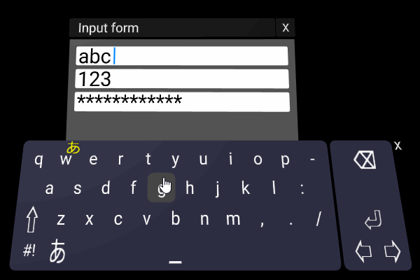

A-FrameでWewbVR試す用の色々

- [Layout](https://binzume.github.io/aframe-xylayout/examples/layout.html)
  - CSS Flexboxのようなレイアウトコンポーネント
- [UI Components](https://binzume.github.io/aframe-xylayout/examples/window.html)
  - UIコンポーネント色々
  - 見た目ちょっとしょぼい
- [Software keyboard](https://binzume.github.io/aframe-xylayout/examples/keyboard.html)  [WIP]
  - WebVR内で日本語入力するためのソフトウェアキーボード
  - ハードウェアキーボードの入力も拾います
  - [Google CGI API for Japanese Input](https://www.google.co.jp/ime/cgiapi.html) を使っています

